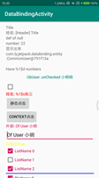

## 🔥Android-Jetpack-Demo

[](https://developer.android.com/jetpack/) [](./LICENSE) 
[](https://android-arsenal.com/api?level=21) [](https://travis-ci.org/zhiwei1990/android-jetpack-demo) [](https://sonarcloud.io/dashboard?id=zhiwei1990_android-jetpack-demo) [](https://codebeat.co/projects/github-com-zhiwei1990-android-jetpack-demo-master)   [](https://github.com/zhiwei1990/android-jetpack-demo/releases)   [](https://hits.seeyoufarm.com)


目录
=================

* [<g-emoji class="g-emoji" alias="fire" fallback-src="https://github.githubassets.com/images/icons/emoji/unicode/1f525.png">🔥</g-emoji>Android-Jetpack-Demo]()
	* [一、项目简介]()
	* [二、更新日志]()
	* [三、Sample示例]()
	* [四、项目组成[^1]]()
	* [五、规划]()
	* [六、示例内容(部分）]()
	* [七、关于作者]()[](https://www.jianshu.com/u/72294e6848c0)[](https://github.com/zhiwei1990)[](https://blog.csdn.net/zhiwei9001)

####  一、项目简介

> 更新前言：不觉间项目已经三年有余了，Kotlin和Jetpack相关技术点也更新了很多，更成了为Android开发的技术首选。
>
> 忙碌于生活的苟且，屈服于资本家压榨之下，身心俱疲。颇有久在樊笼里的感觉，只想做个纯粹的技术人，做自己感兴趣的事，有意义的事，也希望后续可以给各位朋友带来一些学习的分享。共勉之。

<font color="green">**感谢支持的各位小伙伴，有技术问题或学习问题都可以在issues中留言**</font>

**Android-Jetpack-Demo** 全新设计开发中,会集合当下Android应用开发的Kotlin语言相关技术知识点、Jetpack各组建的使用及相关原理源码分析文章等。

**代码清理全新设计中,所以为空项目，历史代码可参照[source](https://github.com/zhiwei1990/android-jetpack-demo/releases/tag/v2.0.0-alpha01)这里下载。**

#### 二、更新日志

- **2.0.0（2021年4月8日）ing……**
  - 逐步的重新设计Demo的app
  - 加入Kotlin进阶语法和协程Coroutines的知识分析
  - UI改用Jetpack Compose设计
  - 其他Jetpack的组件用例及分析

- 2.0.0-alpha01(2019年11月28日)
  - 更新`jetpack`组件版本
  - `kotlin`进阶语法的基本学习
  - 简单的初步分模块

- v1.1.0（2019年6月27日）
  - 更新`AndroidStudio`以及`Gradle`编译版本
  - 更新`jetpack`及`kotlin`版本为当前最新
  - 压缩存档，以备模块化版本
  - `kotlin`初级语法的基础博文
- v1.0.0（2018年11月14日）
  - 实现`jetpack`组件的初级基础用法的演示
  - `dagger2`的基础用法演示
  - `kotlin`初级语法的整理注释
  - `databinding`的基础用法
  - `AAC`的初级使用

#### 三、Sample示例(这是以前老版本的)

[下载体验apk](https://raw.githubusercontent.com/zhiwei1990/android-jetpack-demo/master/docs/apk/app-release.apk)或者手机扫描二维码下载`Demo`的`apk`包


#### 四、项目组成[^1]

项目主要简单的演示`Android`当前应用开发层面的前沿技术与框架库使用，`RxJava`操作符、`Kotlin`语法及进阶，协程Coroutines的分析及使用，以及`JetPack`的组件的进阶使用。

#### 五、示例内容(1.x版本部分）



- `Kotlin`语法及部分博文[Kotlin](https://www.jianshu.com/p/bdbe2ab6e9b2)

```kotlin
package org.zhiwei.jetpack.kt.base

/**
 * 作者： 志威  zhiwei.org
 * 主页： Github: https://github.com/zhiwei1990
 * 日期： 2019年09月19日 11:13
 * 签名： 天行健，君子以自强不息；地势坤，君子以厚德载物。
 * You never know what you can do until you try !
 * ----------------------------------------------------------------
 * Kotlin的类与对象的相关定义与信息
 * 1、kotlin中class定义类，默认都是public的，而且是final 的，不可继承
 * 2、若要可继承，就需要open关键词修饰
 * 3、一个kt文件中可以多个class，以及混合top level的变量/常量/函数的定义
 * 4、默认定义的class是final的，其内部的变量/函数，也就不必要使用protected的权限，其作用也就相当于private了。
 * 5、每个class类都有一个伴生静态object类companion object 在class加载的时候就初始化了，作为类的静态成员存在。（object类，自身是没有伴生类的）
 * 6、kotlin不同于java，一般的声明成员属性，不用getter/setter，当然除非你要控制只能getter不能setter，那样就需要重写
 * 7、在class定义函数和top level中差不都，也就是protected这个权限符号的区分。默认函数也是final的。
 */
public final class KtClazz {

    //<editor-folder desc="类的构造函数的讲解模块">

    constructor()//默认class类都有一个的无参构造函数

    constructor(name: String)//这样写三个构造函数，属于平级，所以不需要依次调用。倘若在上面class KtClazz后添加了构造函数

    constructor(name: String, age: Int)

    //</editor-folder>

    //<editor-folder desc="类函数的定义模块">

    //简单演示class中的变量/常量声明定义
    private var abc = "abc"
    protected var bbc = "bbc"//这里会注意，在top level中 不能protected修饰变量，函数的定义，class中可以
    // ，但是对于一个final的（也就是默认声明）类，这个权限也就相当于private了，只有对于open的class，protected的变量，才能被子类操作
    internal var cbc = "cbc"
    public var dbc = "dbc"

    var bNum = 0b001//二进制的表示数
    var hNum = 0x0f00e//16进制数，kotlin中没有8进制的表示
    var bigNum = 00_999_999_000.000//可以使用_下划线分割数据，便于读取，但是不会影响实际数值
    val longStr = """long str \srng\t\'在这种string的方式，转义符也会失效"""

    val name = "class name is a final value"//类中可以声明不可变量，也就是普通常量，但是不是static的静态的，如果声明静态需要在其伴生对象中


    /**
     * 函数的定义，默认也是public final的，权限符号可以修改，如果想要被继承，就要用open修饰
     * 只要class中有一个函数是open的，那么这个class就必须是open的。
     */
    public final fun configData() {
        println("普通默认的无参函数定义")
    }

}
//更多的详见代码 ......
```

更多详情，请下载代码，内有详细注释，**鉴于本人才学有限，若有不足之处，请大神不吝赐教**。

#### 六、关于作者 [](https://www.jianshu.com/u/72294e6848c0)[](https://github.com/zhiwei1990)[](https://blog.csdn.net/zhiwei9001)

> 作者本人只是一个，就职于某`知名`(@_@ 有名字的)互联网公司的，技术小白一枚，对于编程有着某种兴趣和热爱，然技术确实渣渣，好读书、不求甚解~~

`人之为学有难易乎、为之，则难者亦易矣；不为，则易者亦难矣。`

倘若本项目对你有一丝丝的帮助和价值，烦请给个`star`,或者有什么好的建议或意见，也可以发个`issues`，谢谢！:happy:

- **Donations**

  > 测试一下`Github`爱心💗**sponsor**功能,说不定您心血来潮了呢😂

  
  
- **感谢以下捐助者**，您的鼓励更是我的动力；即使没有捐赠的各位好友，还请不要吝惜`star/follow`或者`issues`的建议。

  

[](https://github.com/zhiwei1990/android-jetpack-demo)[](https://github.com/zhiwei1990/android-jetpack-demo)[](https://github.com/zhiwei1990/android-jetpack-demo)

- **License**

```markdown
Copyright 2021 zhiwei1990

Licensed under the Apache License, Version 2.0 (the "License");
you may not use this file except in compliance with the License.
You may obtain a copy of the License at

	http://www.apache.org/licenses/LICENSE-2.0

Unless required by applicable law or agreed to in writing, software
distributed under the License is distributed on an "AS IS" BASIS,
WITHOUT WARRANTIES OR CONDITIONS OF ANY KIND, either express or implied.
See the License for the specific language governing permissions and
limitations under the License.
```

[](https://starchart.cc/zhiwei1990/android-jetpack-demo)

[^1]: 为研究最新`jetpack`组件的版本和特性，项目当前`(2021/05/30)`开发环境为AndroidStudio `7.0.0-alpha14`、`gradle 7.1.0-alpha01`、  `Jdk8`、`Kotlin 1.5.10`
[^2]: **项目使用`AS`及相关环境配置可能与你本地不同，**参照 [配置gradle](https://github.com/zhiwei1990/android-jetpack-demo/issues/3#issuecomment-840276571)

