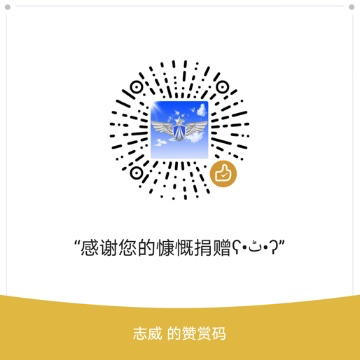

## 🔥Android-Jetpack-Demo

[](https://developer.android.com/jetpack/) [](./LICENSE)
[](https://android-arsenal.com/api?level=24) [](https://sonarcloud.io/dashboard?id=iOrchid_android-jetpack-demo) [](https://codebeat.co/projects/github-com-iOrchid-android-jetpack-demo-master)   [](https://github.com/iOrchid/android-jetpack-demo/releases)   [](https://hits.seeyoufarm.com)


目录
=================

* [<g-emoji class="g-emoji" alias="fire" fallback-src="https://github.githubassets.com/images/icons/emoji/unicode/1f525.png">🔥</g-emoji>Android-Jetpack-Demo]()
  * [一、项目简介]()
  * [二、更新日志]()
  * [三、Sample示例]()
  * [四、项目组成[^1]]()
  * [五、规划]()
  * [六、示例内容(部分）]()
  * [七、关于作者]()[](https://www.jianshu.com/u/72294e6848c0)[](https://github.com/iOrchid)[](https://blog.csdn.net/zhiwei9001)

> 前言：业务时间用**Kotlin+Compose**写了一个项目，欢迎下载体验
>
> 

####  一、项目简介

学习主要以项目代码为准，主要分三个部分模块：

1. `kotlin`文件夹，下面是面向kotlin语言的初学教程，基本语法；学习之后，可以上手写kotlin，相信你会爱上简约高效的语法糖。
2. `jetpack`文件夹下，主要演示了通用的几个`jetpack`
   的组件`liveData、lifecycle、viewmodel、paging、workmanager、navigation，databinding、room`等。
3. `compose`算是颠覆性或者**革命性**的Android
   UI的编写方式，说的可能有点夸张😝，但是这种组合式的UI写法和设计思想，真的很不一样，没有了臃肿感、倍儿清爽～。
4. 其他`MVI/MVVM`和`jetpack`的组件，逐步会以简便功能形式添加。
5. 项目断断停停的，工作精力所限，**希望可以动手给star/fork点个赞**👍，有什么问题和建议可以提**issue**，谢谢，<font color="Green">**您的支持与鼓励，是我做项目的动力**</font>。

#### 二、更新日志

- **2.0.0(2024年5月22日) **
  
  - 全新架构设计模块化分组演示Jetpack重要组件的功能使用，以及MVI架构和组件化、项目构建等
  - 使用`compose`的`UI`框架

  
  
- v1.1.0（2019年6月27日）
  - 更新`AndroidStudio`以及`Gradle`编译版本
  - 更新`jetpack`及`kotlin`版本为当前最新
  - 压缩存档，以备模块化版本
  - `kotlin`初级语法的基础博文
  
- v1.0.0（2018年11月14日）
  - 实现`jetpack`组件的初级基础用法的演示
  - `dagger2`的基础用法演示
  - `kotlin`初级语法的整理注释
  - `databinding`的基础用法
  - `AAC`的初级使用

#### 三、Sample示例


#### 四、项目组成[^1]

项目主要简单的演示`Android`
当前应用开发层面的前沿技术与框架库使用， [kotlin](./kotlin/Kotlin语法拾遗.md)
语法及进阶，协程`Coroutines`和 [kotlin flow 简明笔记](./kotlin/kotlin flow 简明笔记.md)
的分析及使用，以及[Compose学习随笔](./compose/Jetpack Compose学习随笔.md)
的组件的进阶使用，`MVI/MVVM架构的实现`,后续会添加模块化与组件化的项目演示。

- **kotlin**分包，主要演示语法基础，快速上手； [Kotlin语法拾遗](./kotlin/Kotlin语法拾遗.md)

  - `basic`基础语法速览
  - `concepts`语法概念基础详解
  - `collections`集合相关的操作符解释
  - `coroutines`协程相关的概念和操作符演示
  - `flow&channel`

- **Jetpack** [Jetpack笔记速览](./jetpack/jetpack笔记速览.md)
  分包下面会演示`livedata`、`lifecycle`、`viewmodel`、`databinding`、`paging`、`workmanager`、`navigation`、`room`
  等核心库的使用与解析

- **Compose**分包下会详细演示`compose`的学习笔记，从基础到整个**UI**实现

  按照页面顺序可逐步学习`compose`的使用，代码基本都有注释；**尤其注意⚠️带警示标记的注释，属于知识点。**


在示例代码中会插入`MVI`和`MVVM`的架构实现。

#### 五、示例内容

- `Kotlin`语法及部分博文[Kotlin](https://www.jianshu.com/p/bdbe2ab6e9b2)

```kotlin
package org.zhiwei.kotlin.basic

//region Kotlin语言的基础语法

//0. 前言：所有编程语言的变量，命名，路径之类的，最好都是纯英文字母和标点符号，切记，可避免日后编程输入的一些问题

//1. 类似于Java语言，包声明处于文件顶部（可以在版权声明注释之后），如上package org.zhiwei.kotlin.basic 的包名；一般用唯一域名倒置方式区分；

//2. 程序入口点main函数，类似于Java ,其中args的形参部分可以不写
fun main(args: Array<String>) {
    //3. 输出打印信息到控制台
    print("输出打印文字，该函数不换行")
    println("Hello world")//换行
}

//4. 函数: 定义函数使用关键字fun 格式：fun 函数名(参数名:参数类型,等等):返回参数类型{ .... return xxx } ;
// 在函数定义处方法（或者叫做函数）入参的参数名称，成为形参，调用该函数的时候，传入的参数具体，叫做实参。
private fun sum(a: Int, b: Int): Int {
    return a + b
}

//4.1 kotlin支持表达式和语法推导，如上的函数可简写为： fun sum(a: Int, b: Int) = a + b
//4.2 若返回类型为Unit，空，类似于Java中的void，则可以省略不写
private fun printSum(a: Int, b: Int) {//此处后面标准格式为：Unit的返回类型
    //在String字符串中，可使用$符号调用函数或者变量，此时上面的sum函数，传入3，5两个参数就是实参，函数定义的a，b叫做形参
    println("打印3+5的计算和： ${sum(3, 5)}")
}

//5. 变量 使用var 定义可变量； val 定义局部或区域内的不可变量，其只能赋值一次；变量的声明格式 var/val 变量名:变量类型 = 值 。可省略类型，如果能够自动推导的。或者可以延迟初始化。
var name: String = "Kotlin"//可变量，name 可以被多次赋值
private val platform: String = "Android" //不可变量，在作用域内被一次赋值之后，不可再改
const val PI: Double = 3.14 //常量，类似于Java的static final  其存放在Jvm的静态常量区，调用使用类名. 或者直接导入。

//6. 不同于Java文件，在Kotlin的kt文件中，可以直接在文件内声明函数，变量，常量，类等定义，而不是Java那种必须在某个类中定义。且一个kt文件可以定义多个public的类。
//6.1 kotlin中定义函数，变量，类，接口等，如果在文件层级，权限修饰符默认是public，则会省略不写。类与函数默认是final的。
//7. 类定义格式class 类名(参数):父类,接口 。类定义可继承父类，实现接口，如果最简化，则如下，class 类名 即可。
public class QuickSyntax //默认前面有修饰符public的，省略不写

interface Shape

//7.1 相对完整的类定义的格式，实现接口
private class Rectangle(var height: Double, var length: Double) : Shape {
    //类内部定义的属性，
    var perimeter = (height + length) * 2
}
//更多的详见代码 ......
```

更多详情，请下载代码，内有详细注释，**鉴于本人才学有限，若有不足之处，请大神不吝赐教**。

#### 六、关于作者 [](https://www.jianshu.com/u/72294e6848c0)[](https://github.com/iOrchid)[](https://blog.csdn.net/zhiwei9001)

> 作者本人只是一个，就职于某`知名`(@_@ 有名字的)互联网公司的，技术小白一枚，对于编程有着某种兴趣和热爱，然技术确实渣渣，好读书、不求甚解~~

`人之为学有难易乎、为之，则难者亦易矣；不为，则易者亦难矣。`

倘若本项目对你有一丝丝的帮助和价值，烦请给个`star`,或者有什么好的建议或意见，也可以发个`issues`，谢谢！:happy:

- **Donations**

  > 测试一下`Github`爱心💗**sponsor**功能,说不定您心血来潮了呢😂

  

- **感谢以下捐助者**，您的鼓励更是我的动力。

  

[](https://github.com/iOrchid/android-jetpack-demo)[](https://github.com/iOrchid/android-jetpack-demo)[](https://github.com/iOrchid/android-jetpack-demo)

- **License**

```markdown
Copyright 2018--2024 ©️iOrchid

Licensed under the Apache License, Version 2.0 (the "License");
you may not use this file except in compliance with the License.
You may obtain a copy of the License at

  http://www.apache.org/licenses/LICENSE-2.0

Unless required by applicable law or agreed to in writing, software
distributed under the License is distributed on an "AS IS" BASIS,
WITHOUT WARRANTIES OR CONDITIONS OF ANY KIND, either express or implied.
See the License for the specific language governing permissions and
limitations under the License.
```

[](https://starchart.cc/iOrchid/android-jetpack-demo)

[^1]: 使用最新`Jetpack`组件的版本，项目`(2024/05/06)`开发环境为**AndroidStudio Iguana** `2023.3.1`
[^2]: **项目使用`AS`及相关环境配置可能与你本地不同，**参照 [配置gradle](https://github.com/iOrchid/android-jetpack-demo/issues/3#issuecomment-840276571)
[^3]: 参照`Compose`项目有[compose cookbook](https://github.com/Gurupreet/ComposeCookBook)，[compose tutorial](https://github.com/SmartToolFactory/Jetpack-Compose-Tutorials),[compose codelab](https://github.com/android/codelab-android-compose),[compose sample](https://github.com/android/compose-samples)
致敬感谢.

