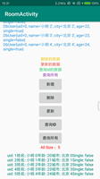
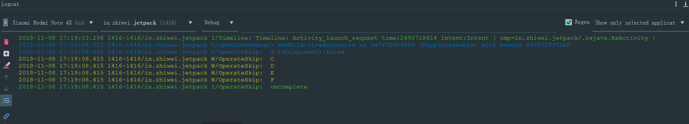

## 🔥Android-Jetpack-Demo

[](https://developer.android.com/jetpack/) [](./LICENSE) 
[](https://android-arsenal.com/api?level=21) [](https://travis-ci.org/zhiwei1990/android-jetpack-demo) [](https://sonarcloud.io/dashboard?id=zhiwei1990_android-jetpack-demo) [](https://codebeat.co/projects/github-com-zhiwei1990-android-jetpack-demo-master)   [](https://github.com/zhiwei1990/android-jetpack-demo/releases)   [](http://hits.dwyl.io/zhiwei1990/android-jetpack-demo)


目录
=================

* [<g-emoji class="g-emoji" alias="fire" fallback-src="https://github.githubassets.com/images/icons/emoji/unicode/1f525.png">🔥</g-emoji>Android-Jetpack-Demo]()
	* [一、项目简介]()
	* [二、更新日志]()
	* [三、Sample示例]()
	* [四、项目组成[^1]]()
	* [五、规划]()
	* [六、示例内容(部分）]()
	* [七、关于作者]()[](https://www.jianshu.com/u/72294e6848c0)[](https://github.com/zhiwei1990)[](https://blog.csdn.net/zhiwei9001)

####  一、项目简介

> 写在前面，首先感谢各位童鞋对本项目的关注和支持，项目诞生之时，也是自己学习jetpack初期，随着这两年的企业项目实践，对于jetpack的认识也有较为深入的了解，后续将逐步重构掉该项目，使用最新的kotlin+jetpack+coroutines体系，配合详细博文，期待同学们的支持和鼓励！

**Android-Jetpack-Demo** 是一个简单的、集成当前Google主流Android技术的示例Demo，旨在帮助有需要的初级开发者，快速上手Android新技术、新架构。主要使用`livedata`、`lifecycle`、`paging`、`room`、`navigation`、`workmanager`、`rxjava`、`kotlin`、`dagger2`以及`viewmodel`的**MVVM**简单架构。

> 代码中都有详细的注释，主要操作演示**关注`logcat`的日志**输出

#### 二、更新日志

- 2.0.0-alpha01(2019年11月28日)
  - 更新`jetpack`组件版本
  - `kotlin`进阶语法的基本学习
  - 简单的初步分模块

- v1.1.0（2019年6月27日）
  - 更新`AndroidStudio`以及`Gradle`编译版本
  - 更新`jetpack`及`kotlin`版本为当前最新
  - 压缩存档，以备模块化版本
  - `kotlin`初级语法的基础博文
- v1.0.0（2018年11月14日）
  - 实现`jetpack`组件的初级基础用法的演示
  - `dagger2`的基础用法演示
  - `kotlin`初级语法的整理注释
  - `databinding`的基础用法
  - `AAC`的初级使用

#### 三、Sample示例

[下载体验apk](https://raw.githubusercontent.com/zhiwei1990/android-jetpack-demo/master/apk/app-release.apk)或者手机扫描二维码下载`Demo`的`apk`包


#### 四、项目组成[^1]

项目主要简单的演示一些`android`技术与框架库的入门使用，`RxJava`操作符、`Kotlin`基本语法，以及`JetPack`的组件的简单使用。

- `Android Architecture Components`
- `RxJava`
- `Kotlin`
- `Dagger2`
- **Jetpack**
  - `lifecycle`
  - `livedata`
  - `databinding`
  - `navigation`
  - `paging`
  - `room`
  - `workmanager`

#### 五、规划

- [x] 基础使用入门的代码演示
- [x] `DataBinding`代码详解
- [x] `Kotlin`代码详解
- [ ] `jetpack`组件的使用详解
- [ ] `rxJava`的使用详解
- [ ] `dagger/koin`注入框架的演示详解
- [ ] `App`架构相关的详解
- [ ] 进阶技术&架构的演示

#### 六、示例内容(部分）



- `Kotlin`语法及部分博文[Kotlin](https://www.jianshu.com/p/bdbe2ab6e9b2)

```kotlin
package org.zhiwei.jetpack.kt.base

/**
 * 作者： 志威  zhiwei.org
 * 主页： Github: https://github.com/zhiwei1990
 * 日期： 2019年09月19日 11:13
 * 签名： 天行健，君子以自强不息；地势坤，君子以厚德载物。
 *      _              _           _     _   ____  _             _ _
 *     / \   _ __   __| |_ __ ___ (_) __| | / ___|| |_ _   _  __| (_) ___
 *    / _ \ | '_ \ / _` | '__/ _ \| |/ _` | \___ \| __| | | |/ _` | |/ _ \
 *   / ___ \| | | | (_| | | | (_) | | (_| |  ___) | |_| |_| | (_| | | (_) |
 *  /_/   \_\_| |_|\__,_|_|  \___/|_|\__,_| |____/ \__|\__,_|\__,_|_|\___/  -- 志威 zhiwei.org
 *
 * You never know what you can do until you try !
 * ----------------------------------------------------------------
 * Kotlin的类与对象的相关定义与信息
 * 1、kotlin中class定义类，默认都是public的，而且是final 的，不可继承
 * 2、若要可继承，就需要open关键词修饰
 * 3、一个kt文件中可以多个class，以及混合top level的变量/常量/函数的定义
 * 4、默认定义的class是final的，其内部的变量/函数，也就不必要使用protected的权限，其作用也就相当于private了。
 * 5、每个class类都有一个伴生静态object类companion object 在class加载的时候就初始化了，作为类的静态成员存在。（object类，自身是没有伴生类的）
 * 6、kotlin不同于java，一般的声明成员属性，不用getter/setter，当然除非你要控制只能getter不能setter，那样就需要重写
 * 7、在class定义函数和top level中差不都，也就是protected这个权限符号的区分。默认函数也是final的。
 * 8、如果class是final的，函数open修饰，是无效的。而且，open的函数或者变量不能private修饰，且与final修饰符是互斥的。
 * 9、构造函数分为主构造函数，次构造函数，而且kotlin中，如果主构造函数显式的写在class的名后，则所有次级构造函数必须调用主构造函数
 * 10、class类都有一个自身的init函数，在class加载时候就运行，早于构造函数的调用！！！
 * 11、接口实现，或者类的继承，需要用:，类似于java中的extends，implementation,可多个接口，但只有一个父类
 * 12、抽象类abstract，其抽象函数 不同于接口的函数，它是不能有默认方法体的。
 * 13、如果子类实现多个接口，且接口中拥有共同的函数命，就会冲突，在子类中就需要显式指明调用哪个
 * 14、单例类object，也就是静态的单例模式，
 * 15、数据类，一个数据bean对象的类，特殊的class 使用data class 声明
 */
public final class KtClazz {

    //<editor-folder desc="类的构造函数的讲解模块">

    constructor()//默认class类都有一个的无参构造函数

    constructor(name: String)//这样写三个构造函数，属于平级，所以不需要依次调用。倘若在上面class KtClazz后添加了构造函数

    constructor(name: String, age: Int)

    //</editor-folder>

    //<editor-folder desc="类函数的定义模块">

    //简单演示class中的变量/常量声明定义
    private var abc = "abc"
    protected var bbc = "bbc"//这里会注意，在top level中 不能protected修饰变量，函数的定义，class中可以
    // ，但是对于一个final的（也就是默认声明）类，这个权限也就相当于private了，只有对于open的class，protected的变量，才能被子类操作
    internal var cbc = "cbc"
    public var dbc = "dbc"

    var bNum = 0b001//二进制的表示数
    var hNum = 0x0f00e//16进制数，kotlin中没有8进制的表示
    var bigNum = 00_999_999_000.000//可以使用_下划线分割数据，便于读取，但是不会影响实际数值
    val longStr = """long str \srng\t\'在这种string的方式，转义符也会失效"""

    val name = "class name is a final value"//类中可以声明不可变量，也就是普通常量，但是不是static的静态的，如果声明静态需要在其伴生对象中


    /**
     * 函数的定义，默认也是public final的，权限符号可以修改，如果想要被继承，就要用open修饰
     * 只要class中有一个函数是open的，那么这个class就必须是open的。
     */
    public final fun configData() {
        println("普通默认的无参函数定义")
    }

    /**
     * 有参数的函数定义
     */
    private fun paramConfig(name: String, age: Int) {
        println("name: " + name + "age: " + age)
    }

    /**
     * 可变参数的函数定义，这里用到了vararg的关键词，如此调用方就可以传递一个或者多个参数进来。类似于java中的 (String... apple)的写法
     */
    internal fun varargConfig(vararg apple: String) {
        println("该函数，是可以接收可变个数的参数")
    }

    //</editor-folder>

    /**
     * 伴生的object类，静态类，可以写这个KtClassObj的名字，也可以省略不写。
     */
    /*private*/ companion object /*KtClazzObj*/ {
        private const val constName = "静态常量名"//静态常量，声明定义在class的伴生对象类中

    }

}
//更多的详见代码 ......
```

更多详情，请下载代码，内有详细注释，**鉴于本人才学有限，若有不足之处，请大神不吝赐教**。

#### 七、关于作者 [](https://www.jianshu.com/u/72294e6848c0)[](https://github.com/zhiwei1990)[](https://blog.csdn.net/zhiwei9001)

> 作者本人只是一个，就职于某`知名`(@_@ 有名字的)互联网公司的，技术小白一枚，对于编程有着某种兴趣和热爱，然技术确实渣渣，好读书、不求甚解~~

`人之为学有难易乎、为之，则难者亦易矣；不为，则易者亦难矣。`

倘若本项目对你有一丝丝的帮助和价值，烦请给个`star`,或者有什么好的建议或意见，也可以发个`issues`，谢谢！:happy:

- **Donations**

  > 测试一下`Github`爱心💗**sponsor**功能,说不定您心血来潮了呢😂

  

[](https://github.com/zhiwei1990/android-jetpack-demo)[](https://github.com/zhiwei1990/android-jetpack-demo)[](https://github.com/zhiwei1990/android-jetpack-demo)

- **License**

```markdown
Copyright 2020 zhiwei1990

Licensed under the Apache License, Version 2.0 (the "License");
you may not use this file except in compliance with the License.
You may obtain a copy of the License at

	http://www.apache.org/licenses/LICENSE-2.0

Unless required by applicable law or agreed to in writing, software
distributed under the License is distributed on an "AS IS" BASIS,
WITHOUT WARRANTIES OR CONDITIONS OF ANY KIND, either express or implied.
See the License for the specific language governing permissions and
limitations under the License.
```

[](https://starchart.cc/zhiwei1990/android-jetpack-demo)

[^1]: 项目当前`(2020/05/07)`开发环境为AndroidStudio `3.6.3`、`gradle 6.3`、`Jdk8`、`Kotlin 1.3.72`